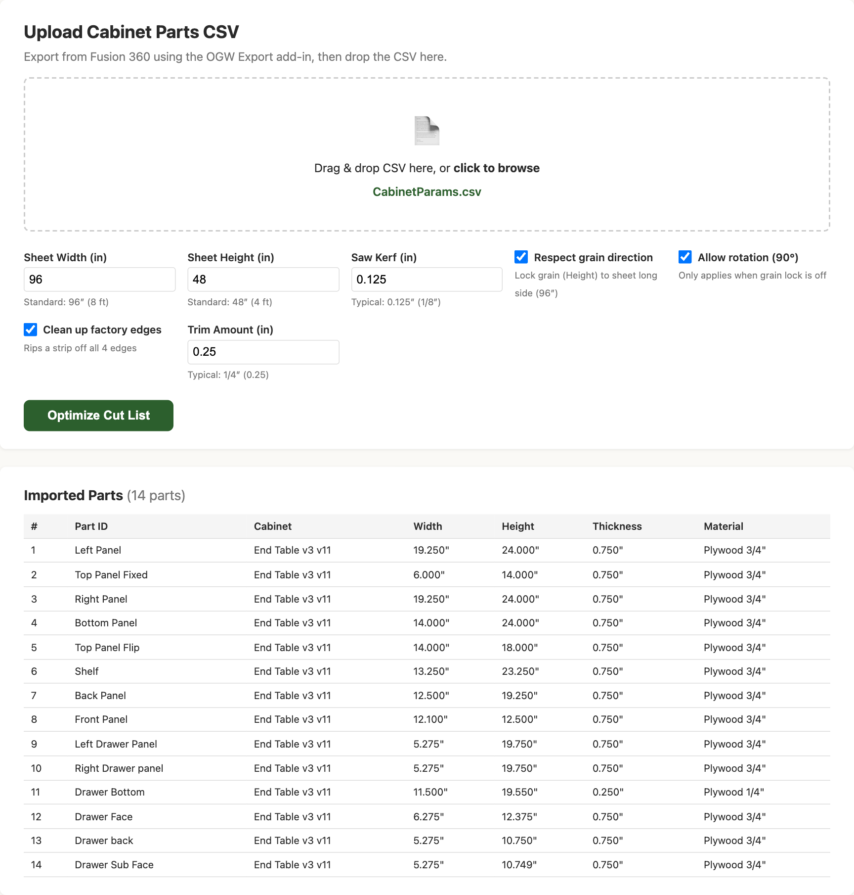
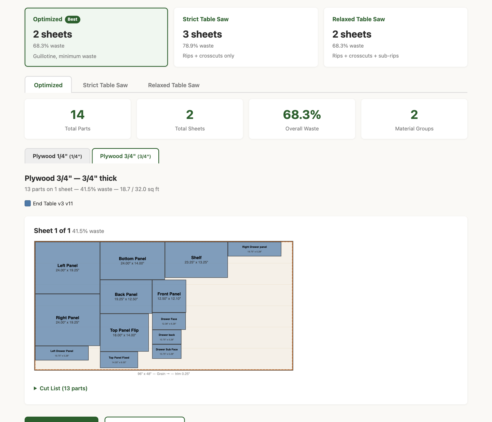
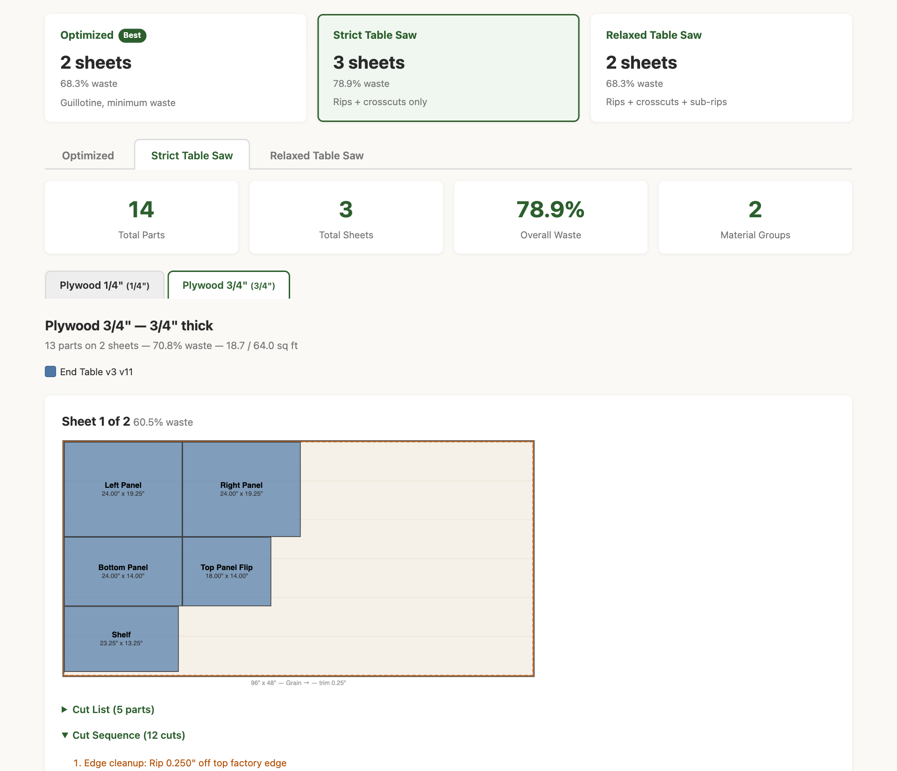
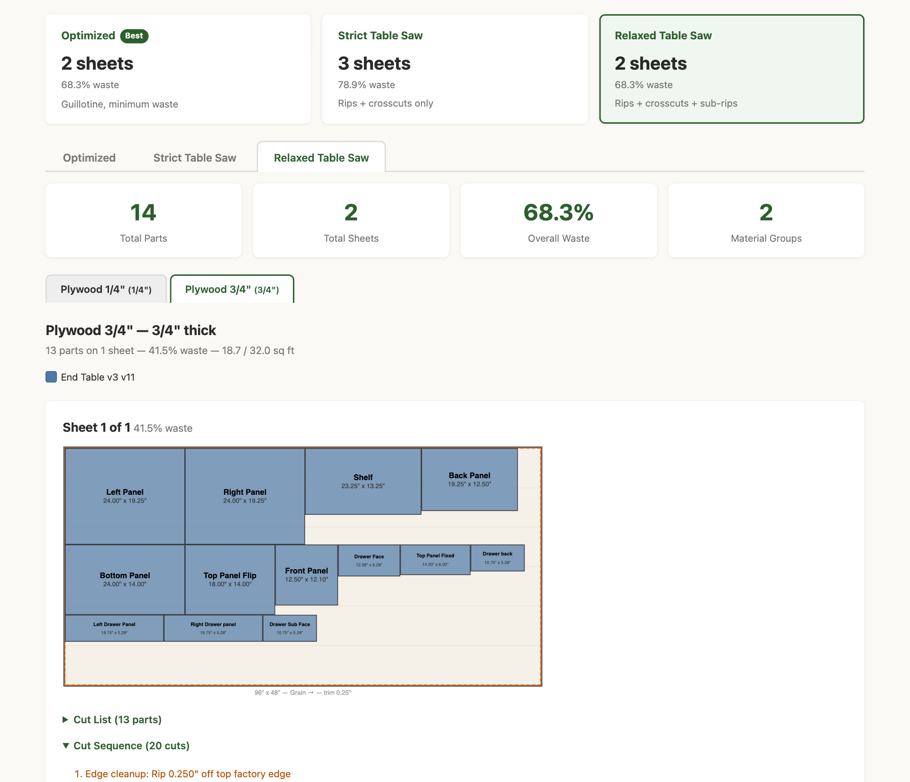

# Fusion 360 Cabinet Optimizer — Mac Edition

A macOS-compatible toolset for optimizing cabinet sheet goods cuts from Fusion 360 designs. Includes a Fusion 360 add-in to export cabinet part dimensions and a standalone browser-based cut list optimizer.

**[Try the Cut List Optimizer online](https://bradyvolpe.github.io/Fusion360-Addon/)** — no install needed, runs in your browser.

Originally based on the [Old Guy Woodworks](https://oldguywoodworks.com) Cabinet Optimizer Distribution 2.0 (Windows). This repo contains a Mac-native port of the Fusion 360 add-in and a completely new single-file cut list optimizer that runs in any browser.

---

## Screenshots

### Upload &amp; Settings
Drop your CSV, configure sheet size, kerf, grain direction, and factory-edge cleanup — then click **Optimize**.



### Mode Comparison
Every run produces three layouts side-by-side. The **Best** badge highlights the fewest-sheet / least-waste option.


### Optimized Layout
Recursive guillotine packing — minimum waste. Grain direction locked, amber trim zones visible on all edges.



### Strict Table Saw
Strip-based layout: every part in a strip shares the same width. Simple rip → crosscut sequence, numbered and color-coded.



### Relaxed Table Saw
Sub-rips in strip tails reduce sheet count back to match Optimized, while keeping cuts predictable.



---

## Quick Start

### 1. Install the Fusion 360 Add-in

```bash
cd Fusion360-Addon
chmod +x Install-Fusion360-Addon.sh
./Install-Fusion360-Addon.sh
```

This copies the add-in files to:
```
~/Library/Application Support/Autodesk/Autodesk Fusion 360/API/AddIns/OGW_ExportCabinetParams/
```

Then in Fusion 360:
1. Go to **Utilities > Add-Ins > Scripts and Add-Ins**
2. Find **OGW_ExportCabinetParams** in the Add-Ins tab
3. Click **Run** (optionally check "Run on Startup")

### 2. Export Parts from Fusion 360

1. Open your cabinet design in Fusion 360 (make sure you're in the **Design** workspace)
2. Go to **SOLID > Create > OGW: Export Cabinet Parameters**
3. Choose an export folder and filename
4. The add-in scans all visible bodies and exports a CSV

### 3. Optimize Your Cut List

**Option A — Online:** Open **[bradyvolpe.github.io/Fusion360-Addon](https://bradyvolpe.github.io/Fusion360-Addon/)**

**Option B — Local:** Open `index.html` in any browser (just double-click it)

Then:
1. Drag & drop the exported CSV onto the upload area
2. Adjust settings if needed (sheet size, kerf, grain direction, edge cleanup)
3. Click **Optimize Cut List**
4. Compare layouts across three cut patterns and print the one that fits your workflow

---

## What's in This Repo

| File | Description |
|------|-------------|
| `index.html` | Cut list optimizer — runs entirely in the browser ([live version](https://bradyvolpe.github.io/Fusion360-Addon/)) |
| `Fusion360-Addon/OGW_ExportCabinetParams.py` | Fusion 360 add-in that exports cabinet dimensions to CSV |
| `Fusion360-Addon/OGW_ExportCabinetParams.manifest` | Add-in metadata (Windows + Mac) |
| `Fusion360-Addon/Install-Fusion360-Addon.sh` | macOS installer script for the add-in |
| `Fusion360-Addon/BodyPartsOrientation.csv` | Orientation rules mapping 120+ cabinet part names to local X/Y/Z axes |

---

## How It Works

### Workflow

```
Fusion 360 Cabinet Design
        |
        v
OGW Export Add-in (scans design, extracts dimensions)
        |
        v
CSV File: Part_ID, Cabinet_ID, Width, Height, Depth, Units, Material
        |
        v
Cut List Optimizer (browser-based, online or local)
        |
        v
Optimized cut layouts with visual sheet maps (printable)
```

### CSV Format

The add-in exports a CSV with these columns:

| Column | Description |
|--------|-------------|
| `Part_ID` | Part/body name (e.g., "Left Side", "Back Panel") |
| `Cabinet_ID` | Parent cabinet name (e.g., "Base_30", "Wall_36") |
| `Width` | Panel face dimension 1 |
| `Height` | Panel face dimension 2 |
| `Depth` | Material thickness |
| `Units` | `in` or `mm` |
| `Material` | Material name (can be empty — optimizer auto-labels by thickness) |

### Cut List Optimizer Features

#### Three Cut Patterns — side-by-side comparison

Every run produces three layouts simultaneously. A comparison card shows sheets and waste % for each; click any card or tab to switch the view.

| Mode | How it works | Trade-off |
|------|-------------|-----------|
| **Optimized** | Recursive guillotine packing — minimum waste | Cuts may require picking up and repositioning panels mid-sequence |
| **Strict Table Saw** | Strips (rip → crosscut only) — every part in a strip shares the same width | Simplest cuts; some extra waste |
| **Relaxed Table Saw** | Strips + sub-rips in the leftover tail of each strip | Fewer sheets than Strict; slightly more complex but still predictable |

#### Grain Direction

- The **Height** column from the Fusion 360 add-in maps to the grain (long-axis) direction of each panel
- "Respect grain direction" (on by default) locks the grain dim to the 96″ long side of the sheet
- Grain violations (parts that only fit cross-grain) are flagged with ⚠ on the layout

#### Edge Cleanup

- "Clean up factory edges" is on by default with a **1/4″ trim** on all four edges
- Industry standard for cabinet-grade plywood; removes chipped or out-of-square factory edges and creates clean reference edges before any part cuts
- Amount is user-editable (try 1/8″ for premium sheets, 1/2″ for rough construction-grade)
- The SVG layout shows the trim zone as an amber border; cut sequences prepend four edge-cleanup cuts before the main rips

#### Numbered Cut Sequences (table saw modes)

Under each sheet layout in Strict and Relaxed modes, a "Cut Sequence" panel lists every cut in order:

1. Edge cleanup rips and crosscuts (if enabled)
2. Rip cuts — distance from top edge to each strip boundary
3. Crosscuts per strip — distance from left edge to each part boundary
4. Sub-rip crosscuts (Relaxed only)
5. Waste callouts for any leftover at strip or sheet edges

Rip positions are orange, crosscuts blue, sub-rips purple.

#### General

- **Automatic material grouping** — parts grouped by material and thickness (e.g., 3/4" and 1/4" plywood get separate sheet layouts)
- **Configurable settings:** sheet size, saw kerf, grain lock, allow rotation, edge cleanup trim amount
- **Color-coded SVG layouts** — each cabinet gets a distinct color, parts labeled with IDs and dimensions
- **Per-sheet cut lists** — expandable table under each sheet showing every part and any grain notes
- **Print-friendly** — click Print for clean layouts without UI chrome
- **Zero dependencies** — no server, no installs, just one HTML file

### Fusion 360 Add-in Features

- Scans all visible bodies across top-level occurrences
- Three-tier dimension lookup:
  1. Named model parameters on components
  2. Design user parameters with prefix matching (e.g., `Base_30_Width`)
  3. Fallback to oriented bounding box
- Orientation rules via `BodyPartsOrientation.csv` for accurate axis-to-dimension mapping
- **Thickness lock** — always assigns the smallest dimension as thickness (prevents swapped dimensions for rotated parts)
- Partial name matching (e.g., "nailer(1)" matches "nailer" rule)
- Exports unmatched parts to a separate CSV for rule refinement
- Preferences saved to `~/OGW_ExportCabinetParams.json`

---

## Customizing Orientation Rules

The `Fusion360-Addon/BodyPartsOrientation.csv` file maps part names to X/Y/Z axis assignments:

```csv
Body Name,Thickness,Length,Width
Back,y,z,x
Bottom,z,x,y
Door Face,y,z,x
Shelf,z,x,y
```

Each axis value (`x`, `y`, or `z`) tells the add-in which local axis corresponds to that dimension. Edit this file to match your shop's naming conventions. The file includes 120+ rules covering common cabinet parts (doors, drawers, shelves, nailers, stiles, rails, etc.).

---

## Requirements

- **macOS** (tested on macOS Sonoma+)
- **Fusion 360** (for the export add-in)
- **Any modern browser** — Safari, Chrome, Firefox, etc. (for the optimizer)
- No Python, Node.js, or other runtime needed for the optimizer

---

## Troubleshooting

| Issue | Solution |
|-------|----------|
| "No active design" error | Make sure a design is open and you're in the **Design** workspace (not Drawing or CAM). |
| Add-in doesn't appear in Fusion 360 | Verify `.manifest` file was copied alongside `.py`. Restart Fusion 360. |
| Installer says "AddIns folder not found" | Run Fusion 360 at least once before installing to create the folder. |
| CSV has empty Material column | The optimizer auto-labels parts by thickness (e.g., "Plywood 3/4""). |
| Parts show as "exceeds sheet size" | Check dimensions — part may be larger than your configured sheet size. Also check if edge cleanup is on; effective sheet size is reduced by 2× the trim amount per axis. |
| Orientation rules not loading | Verify `BodyPartsOrientation.csv` is next to the `.py` file in the AddIns folder. |
| Identical parts have swapped dimensions | The thickness-lock feature (enabled by default) should prevent this. If it persists, check that you have the latest add-in version installed. |
| Grain ⚠ warning on a part | The part couldn't fit grain-aligned anywhere on the sheet. Either the part is nearly square (rotation doesn't help much) or the effective sheet area is too small after trimming. Try reducing the trim amount or disabling grain lock for that run. |
| Strict/Relaxed mode shows more sheets than Optimized | Expected — strip-based packing trades waste efficiency for cut simplicity. Relaxed usually closes the gap significantly. |

---

## Credits

- Original Windows distribution: [Old Guy Woodworks](https://oldguywoodworks.com)
- Mac port and cut list optimizer: Built with [Claude Code](https://claude.ai/code)
